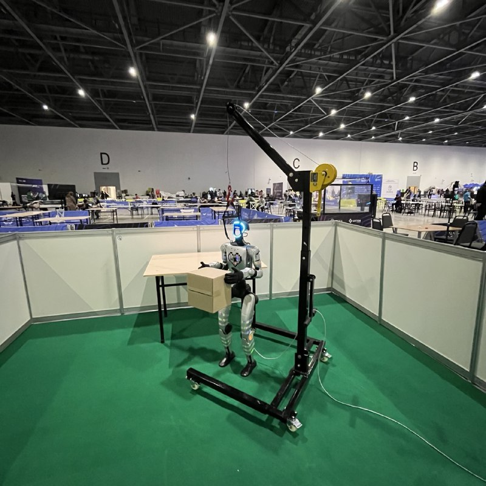

# G1 Humanoid – Autonomous Box Pickup & Handover

Autonomous system for the **Unitree G1 humanoid robot** that detects a box using computer vision, walks to it, grabs it with both arms, then finds a nearby human and hands the box over.

## Demo



[▶ Watch demo video](media/g1_box_handover.mp4)

## The Competition

This project was built for **Hackathon 2** — a humanoid robotics championship where each team must program a Unitree G1 to perform a **fully autonomous box pickup and handover** task.

### Setup & Equipment

- **Competition zone:** 4 × 4 meters per team
- **Robot:** Unitree G1 humanoid (standard hardware only)
- **Box:** Standardized 24 × 24 × 20 cm
- **Table:** One table placed inside the zone
- **Safety:** Crane system to prevent falls (hardware protection only)

### Task Rules

1. Robot starts from an initial position
2. Autonomously walk within the zone and **detect a box** on the table
3. **Approach** the table and **grasp** the box using standard dummy hands
4. **Carry** the box back to the initial position
5. **Hand over** the box to a team member

> **No human intervention, teleoperation, or manual correction is allowed once a run begins.** Only standard Unitree G1 hardware may be used — no custom or dexterous hands.

## Architecture

```
G1 Robot (192.168.123.164)                     Local Machine (192.168.123.222)
┌──────────────────────────────┐              ┌──────────────────────────────────────┐
│                              │              │                                      │
│  RealSense Camera            │              │  camera_gpu.py / vision_control.py   │
│    ├─ RGB  (/dev/video4)     │   UDP :5600  │    ├─ Receives RGB + Depth           │
│    │   → gst_stream.sh ──────│──── RTP ────►│    ├─ Runs YOLO (box + human + pose) │
│    │                         │              │    └─ Publishes JSON via UDP :9999    │
│    └─ Depth                  │   TCP :5601  │                                      │
│        → depth_tcp.py ───────│──── TCP ────►│  task.py (state machine)             │
│                              │              │    ├─ Listens UDP :9999               │
│                              │              │    ├─ Controls locomotion              │
│                              │              │    └─ Controls arms via IK            │
└──────────────────────────────┘              └──────────────────────────────────────┘
```

## State Machine (`task.py`)

The main task runs an 8-state machine:

| # | State | Description |
|---|-------|-------------|
| 1 | `ROTATING` | Spin in place until a box is detected |
| 2 | `ALIGNING` | Center the box in the camera frame |
| 3 | `APPROACHING` | Walk toward the box, stop at target distance |
| 4 | `DONE` | Stop, close arms around the box (Phase 2 arms) |
| 5 | `ROTATING_HUMAN` | Spin until a human is detected |
| 6 | `ALIGNING_HUMAN` | Center the human in the camera frame |
| 7 | `APPROACHING_HUMAN` | Walk toward the human |
| 8 | `FINAL` | Stop, open arms to hand over (Phase 1 arms) |

## Installation

### System Dependencies

```bash
# GStreamer (for camera streaming)
sudo apt install -y gstreamer1.0-tools gstreamer1.0-plugins-base \
  gstreamer1.0-plugins-good gstreamer1.0-plugins-bad \
  gstreamer1.0-libav libgirepository1.0-dev

# v4l2-utils (for depth capture on G1)
sudo apt install -y v4l-utils
```

### Python Packages

```bash
pip install numpy opencv-python torch torchvision ultralytics           # Vision & ML
pip install unitree_sdk2py                                              # Robot SDK
pip install pin casadi meshcat                                          # Arm IK (Pinocchio + CasADi)
pip install PyGObject                                                   # GStreamer Python bindings
```

> **Note:** For GPU acceleration in `camera_gpu.py`, install the CUDA version of PyTorch:
> ```bash
> pip install torch torchvision --index-url https://download.pytorch.org/whl/cu121
> ```

### Model Weights

- **Box detector** — train your own (see [Training](#training-the-box-detector)) or place weights at `runs/detect/runs/train/box_detector/weights/best.pt`
- **Human detection** — `yolo26n.pt` (auto-downloaded by Ultralytics if missing)
- **Pose estimation** — `yolo26n-pose.pt` (auto-downloaded by Ultralytics if missing)
- **Locomotion policy** — `weights/policy_better.pt` (required only for simulation mode)

## Quick Start

### Step 1 — Start camera streams on the G1

SSH into the robot and start the RGB + depth streams:

```bash
ssh unitree@192.168.123.164   # password: 123

# Start RGB stream (GStreamer → UDP)
./gst_stream.sh               # streams to 192.168.123.222:5600

# Start depth stream (TCP)
python3 depth_tcp.py           # serves on port 5601
```

### Step 2 — Start the vision pipeline (local machine)

```bash
# GPU-accelerated detection (box + human + pose) — recommended
python camera_gpu.py --udp-ip 127.0.0.1 --udp-port 9999

# Or box-only detection (lighter)
python vision_control.py --udp-ip 127.0.0.1 --udp-port 9999
```

### Step 3 — Run the task

```bash
# On the real robot
python task.py --real --network enp3s0

# In simulation
python task.py
```

The script will prompt you to press Enter twice (once to initialize, once to start), then the robot begins the autonomous sequence. Type `E` + Enter at any time to stop.

## File Reference

| File | Description |
|------|-------------|
| `task.py` | **Main script** — full state machine (box → grab → human → handover) |
| `box_follower.py` | Simpler variant — box-only state machine (rotate → align → approach → grab) |
| `camera_gpu.py` | GPU-accelerated vision: box detection + human detection + pose estimation, publishes JSON via UDP |
| `vision_control.py` | CPU vision: box detection only, publishes JSON via UDP |
| `human_detector.py` | Standalone human detector with full-body filtering |
| `unitree_controller.py` | Wrapper around Unitree SDK — handles `Move`, `Start`, `Damp`, `LockStanding` for both real robot and simulation |
| `robot_arm_ik.py` | Inverse kinematics solver for G1 dual arms (using Pinocchio + CasADi) |
| `depth_tcp.py` | Depth streaming server — captures Z16 depth from `/dev/video0` via `v4l2-ctl` and serves over TCP :5601 (run on G1) |
| `robot_arm.py` | Low-level arm motor controller (`G1_29_ArmController`) |
| `move_sim.py` | Simulation locomotion policy inference (`G1Config`, `InferenceEnv`) |
| `train.py` | YOLO training script for the custom box detector |
| `gst_stream.sh` | GStreamer streaming script — run on the G1 to send RGB to local machine |
| `test_receiver.py` | Debug tool — prints UDP detection status |
| `main.py` | Minimal test script for robot locomotion |
| `g1/` | URDF model and meshes for the G1 robot |
| `dataset/` | Training images + labels for the custom box detector |
| `weights/` | Locomotion policy weights |

## Training the Box Detector

```bash
python train.py
```

Trains YOLOv2 (`yolo26n.pt` base) on the `dataset/` folder for 100 epochs. Results are saved to `runs/train/box_detector/`.

## Tunable Parameters

Key parameters in `task.py` (also in `box_follower.py`):

| Parameter | Default | Description |
|-----------|---------|-------------|
| `ROTATION_SPEED` | -1.0 rad/s | Yaw rate while searching |
| `ALIGNMENT_KP` | 0.5 | Proportional gain for centering |
| `FORWARD_SPEED` | 0.6 m/s | Base forward walking speed |
| `CENTER_THRESHOLD` | 30 px | Pixel tolerance for "aligned" |
| `TARGET_DISTANCE` | 0.1 m | Stop distance from target |
| `MAX_LOST_FRAMES` | 15 | Frames of occlusion before reverting |
| `APPROACH_TIMEOUT` | 5.0 s | Max time approaching before auto-stop |
| `DEPTH_STALL_TIME` | 10.0 s | Stop if depth doesn't improve |

## Network Configuration

| Service | Protocol | Port | Direction |
|---------|----------|------|-----------|
| RGB camera stream | UDP (RTP H264) | 5600 | G1 → Local |
| Depth stream | TCP | 5601 | G1 → Local |
| Detection JSON | UDP | 9999 | Local vision → Local task |

Default G1 IP: `192.168.123.164` · Default local IP: `192.168.123.222`